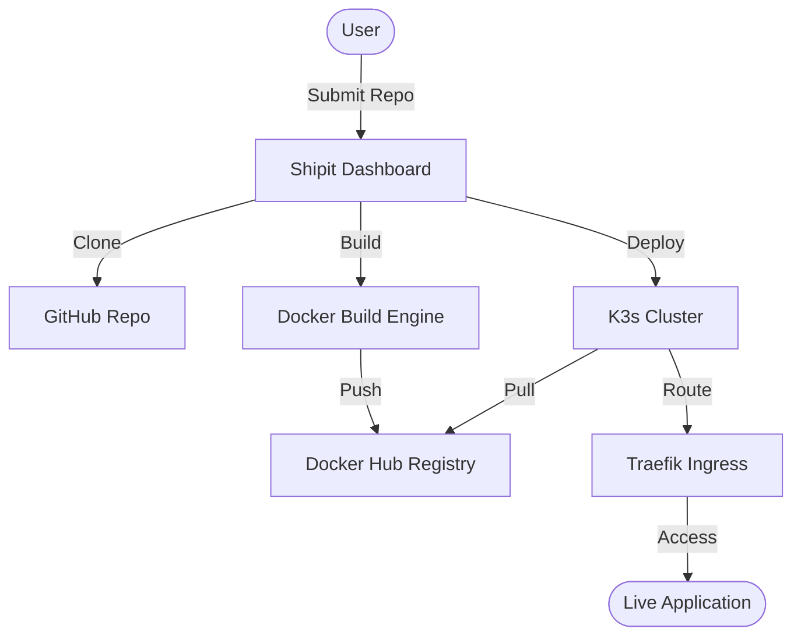

# 🚀 Shipit: Your Personal Mini-PaaS 

A lightweight, high-performance Platform-as-a-Service (PaaS) that transforms your GitHub repositories into live, production-ready applications in seconds. Built with **FastAPI**, **Docker**, and **Kubernetes (K3s)**.

---

## ✨ Key Features

*   **🚀 One-Click Deployment**: Paste a GitHub URL and let Shipit handle the rest.
*   **🐳 Automatic Containerization**: Dynamic Docker builds and pushes to your registry.
*   **☸️ Kubernetes Orchestration**: Automated K8s resource generation and deployment.
*   **🌐 Wildcard Subdomains**: Every project gets its own professional URL instantly.
*   **⚡ Real-time Build Logs**: Watch your deployment progress in a live console.
*   **🔄 CI/CD Support**: Integrated GitHub webhooks for automatic redeployments.

---

## 🛠️ Tech Stack

| Component | Technology |
| :--- | :--- |
| **Backend** |  |
| **Containerization** |  |
| **Orchestration** |  |
| **Infrastructure** |  |
| **Networking** |  |

---

## 🏗️ Architecture



---

## 🚦 Step-by-Step Setup Guide

<details>
<summary><b>1. Infrastructure (AWS EC2)</b></summary>

*   **AMI**: Ubuntu 24.04 LTS
*   **Instance**: `t3.small` (recommended for build performance)
*   **Storage**: 25 GiB SSD
*   **Security Group**: Open Ports `22` (SSH), `80` (HTTP), `443` (HTTPS), and `8000` (Dashboard).
</details>

<details>
<summary><b>2. Domain & DNS (Namecheap)</b></summary>

Add two **A Records** pointing to your AWS Public IP:
*   **Host `@`**: Your Public IP
*   **Host `*`**: Your Public IP (The Wildcard magic)
</details>

<details>
<summary><b>3. Server Configuration</b></summary>

Connect via SSH and run:
```bash
# Update and Install Docker
sudo apt update && sudo apt install docker.io -y
sudo usermod -aG docker ubuntu && newgrp docker
docker login  # Use your Docker Hub credentials

# Install K3s (Kubernetes)
curl -sfL https://get.k3s.io | sh -

# CRUCIAL: Fix Kubernetes Permissions
mkdir -p ~/.kube
sudo cp /etc/rancher/k3s/k3s.yaml ~/.kube/config
sudo chown $USER:$USER ~/.kube/config
export KUBECONFIG=~/.kube/config
echo "export KUBECONFIG=~/.kube/config" >> ~/.bashrc
```
</details>

<details>
<summary><b>4. Launching Shipit</b></summary>

```bash
git clone https://github.com/Sudhanshu-Nijap/shipit.git
cd shipit
pip install -r requirements.txt --break-system-packages

# Start in background (Keep alive after logout)
nohup python3 -m uvicorn app.main:app --host 0.0.0.0 --port 8000 > output.log 2>&1 &

# View live logs
tail -f output.log
```
</details>

---

## 👤 Author

**Sudhanshu Nijap**  
*Full Stack Developer & Platform Engineer*

[](https://github.com/Sudhanshu-Nijap)
